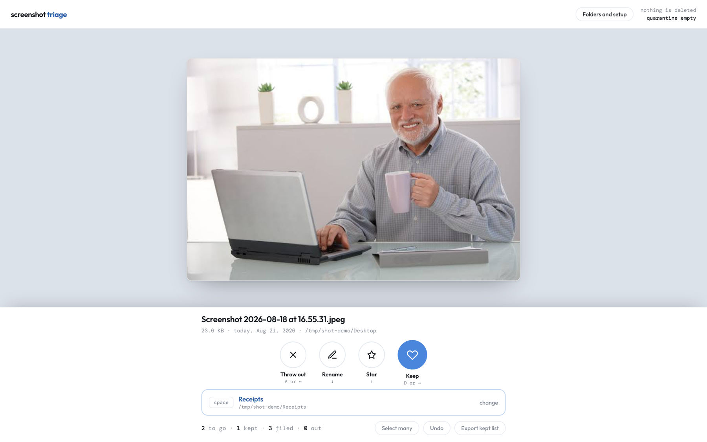

# Screenshot Triage



macOS drops every screenshot on the Desktop and they are never looked at again.
This is a local reviewer for that pile: one file fills the screen, one keystroke
decides it, the next one appears.

A dating app for screenshots, not a file manager.

Python 3, stdlib only. No dependencies, no install step, no network access.

## Run it

```
python3 server.py
```

Opens `http://127.0.0.1:8765/`, or the next free port above it. The first screen
picks the folders to review and the folders things can be filed into.

```
python3 server.py --port 9000 --no-browser
```

## Keys

| Key | What happens |
| --- | --- |
| `A` or `←` | Throw out — moves the file to quarantine, never deletes it |
| `D` or `→` | Keep — the file stays where it is, marked done |
| `W` or `↑` | Star — keeps it, plus whatever starring is set to do |
| `S` or `↓` | Rename, without leaving the card |
| `Space` | File it into the aimed folder |
| `1`–`9` | Aim at that folder and file this one into it |
| `C` | Change what `Space` is aimed at |
| `G` | Open the grid, and again to leave it |
| `Z` | Undo |
| `?` | Every shortcut, on screen |

The card also takes gestures: drag right to keep, left to throw out, up to star.

## Aiming

The bar under the card shows where `Space` sends things. Aim once and every
`Space` after that goes to the same folder, so a run of receipts is five presses
rather than five menus. `C` or a number key changes it. Destination folders are
created if they do not exist, and one can be added mid-session.

## The grid

`G` opens every pending file at once. Drag a band across tiles to select them;
starting the drag on an already-selected tile removes instead of adds, so an
overshoot is corrected with the same gesture. Holding near the top or bottom edge
keeps scrolling. Shift-click takes the whole run between two tiles. One decision
then covers the whole selection, as a single undo step.

## What starring does

Star always keeps the file. What else it does is configurable under **Folders and
setup**:

- **Colour it in Finder** — a Finder label in any of the seven colours. The file
  itself is untouched, but the mark only exists inside Finder.
- **Mark the name** — adds text to the filename, at the front or the back, so the
  mark travels with the file. At the back means before the extension:
  `shot.png` becomes `shot-KEEP.png`, never `shot.png-KEEP`.

A preview shows what the next star will do to a real filename off the queue.
`Z` undoes either kind.

## Nothing is deleted

Throwing a file out moves it to a quarantine folder, by default
`~/.screenshot-triage/quarantine`. Nothing in this app calls `rm`. One button
moves the whole quarantine to the macOS Trash, still recoverable, and that is the
only time anything leaves that folder.

Quarantine deliberately defaults outside the app directory. A checkout is not a
safe place for files the app promises to keep, since `git clean -xfd` ignores
`.gitignore`. It can be pointed anywhere under **Folders and setup** — the folder
picker has a **show hidden** toggle so dot folders are reachable, and **Open in
Finder** goes straight there — and the app flags the choice if it lands somewhere
a repo command could reach.

Every action is undoable, batches included. `Z` walks back through the history
and physically returns files to where they came from. The one thing undo will not
do is pull a file out of the Trash; it says so rather than quietly doing nothing.

## Picking folders

Each suggested folder and each row in the browser shows how many reviewable files
it actually holds, so the pile is visible before anything is scanned. Clicking a
folder adds it directly.

Removing a folder from the list removes its files from the queue. The exception is
a folder macOS refuses to read: an unreadable folder is not evidence its files are
gone, so those stay queued and the denial is reported as a denial. "Nothing left
to review" and "I was not allowed to look" are different sentences and the app
never confuses them. Granting Full Disk Access to the terminal in System Settings
resolves it.

## Speed

Grid tiles are served as cached 480px thumbnails rather than full-resolution
originals, roughly a twentieth of the bytes. Images carry an ETag derived from
each file's own modification time and size, so revisiting a card or redrawing the
grid does not re-read from disk. The card view prefetches the next few images.

## Checking it still works

```
python3 test_triage.py
```

Twenty-five checks against a temp folder, asserting the things that matter: a name
collision never overwrites, a thrown-out file is still on disk, changing the folder
list changes the queue, and undoing everything leaves every file exactly where it
started.

## Layout

```
server.py          the backend, stdlib only
static/index.html  the frontend, one file
test_triage.py     the self-check
run.sh             the same thing, shorter to type
docs/card.png      the image above
data/              local state and thumbnail cache, git ignored
```

## Licence

MIT. See [LICENSE](LICENSE).
