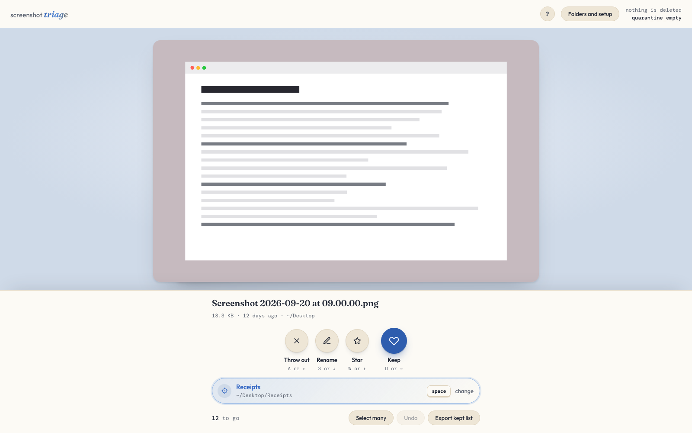

# Screenshot Tinder

[Oliver: Screenshot Tinder or Screenshot Triage? The repo and the site say Tinder, the app window and the folder names say triage.]

The annoying image pile that never stops. Turned into a dating app. One key per screenshot, and nothing is deleted until you confirm. The story behind it is at [oliverschwartz.me](https://oliverschwartz.me/screenshot-triage).



## Why

Screenshots pile up stupidly fast. I wanted sorting them to be fun.

In Finder it is open the folder, drag, confirm, twenty times. Here you press C once to aim at a folder, then Space for every screenshot that goes there.

[Oliver: who is it for besides you?]

## An example

Four screenshots on the Desktop. Space is aimed at a folder called Receipts, and star is set to add `-KEEP` to the name. Keys: Space, A, D, W.

```
Before   ~/Desktop
           Screenshot 2026-09-14 at 09.12.03.png
           Screenshot 2026-09-14 at 09.12.41.png
           Screenshot 2026-09-15 at 18.02.10.png
           Screenshot 2026-09-16 at 07.30.55.png

Keys     Space    A      D      W

After    ~/Desktop/Receipts/Screenshot 2026-09-14 at 09.12.03.png
         ~/.screenshot-triage/quarantine/<id>__Screenshot 2026-09-14 at 09.12.41.png
         ~/Desktop/Screenshot 2026-09-15 at 18.02.10.png
         ~/Desktop/Screenshot 2026-09-16 at 07.30.55-KEEP.png
```

Then Z, and `Screenshot 2026-09-16 at 07.30.55.png` is back on the Desktop under its old name.

## Install and run

macOS and Python 3.9 or newer. Standard library only, nothing to install.

```
git clone https://github.com/o-liverschwartz/screenshot-tinder.git
cd screenshot-tinder
python3 server.py
```

It opens `http://127.0.0.1:8765/`, or the next free port above it. The first screen asks which folders to review and which folders things can be filed into. Browse opens the normal macOS folder dialog. `--port 9000` and `--no-browser` do what they say.

To try it without pointing it at your own Desktop:

```
python3 server.py --demo
```

That makes twelve plain generated screenshots in a temp folder and starts on them. Its state, quarantine and thumbnails stay in that folder too, so your real ones are never touched. The picture above is the demo.

## Keys

| Key | What happens |
| --- | --- |
| `A` or left | Throw out: the file moves to quarantine |
| `D` or right | Keep: the file stays where it is |
| `W` or up | Star: keep it, plus a Finder label or a mark in the name |
| `S` or down | Rename |
| `Space` | Move it into the folder Space is aimed at |
| `1` to `9` | Aim Space at that folder and move this one into it |
| `C` | Change where Space is aimed |
| `G` | Grid of the oldest 200 waiting files, again to leave |
| `Z` | Undo |
| `?` | Every shortcut, on screen |

Or make a grid and apply batch decisions. Drag across tiles to select, shift-click for a run, and one decision covers the selection.

Shortcuts ignore Cmd, Ctrl and Option, and a held key makes one decision.

## Nothing is deleted until you confirm

- Throw out moves the file to `~/.screenshot-triage/quarantine` (settable in Folders and setup). Empty quarantine sends it to the macOS Trash.
- Every action undoes with Z, a batch counts as one, and the history survives a restart.
- A name collision never overwrites. Filing `shot.png` next to another `shot.png` makes `shot 2.png`, and undo does the same if something took the old name.
- A folder macOS refuses to read is reported as unreadable, not as empty, and its files stay in the queue.
- It listens on 127.0.0.1 only and refuses any request whose Host or Origin is not itself. No account, no upload.

## What it does not do

- It only runs on a Mac. Finder labels, the folder dialog and the Trash need macOS.
- It runs one copy at a time. A second launch exits.
- It does not look inside subfolders unless you tick include subfolders.
- It does not guess what a screenshot is. [Oliver: is that a rule, or just not built yet?]

## Check it still works

```
python3 test_triage.py
```

It starts its own server against throwaway files in a temp folder and prints `all checks passed`.

## Layout

```
server.py          the backend, standard library only
static/index.html  the frontend, one file
test_triage.py     the checks
docs/review.png    the image above, taken from --demo
CHANGELOG.md       what changed, newest first
data/              local state, git ignored
```

[Oliver: say here how you used AI to build this, or leave it out?]

## License

MIT. See [LICENSE](LICENSE).
